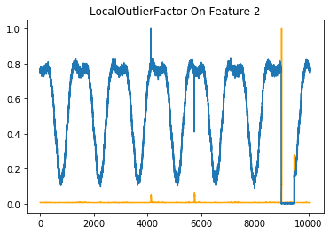
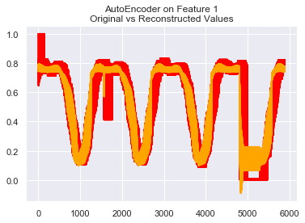

# Anomaly-Detection
Anomaly Detection on Time-Series Sensor Measurement Data by using Unsupervised Machine Leatning and Deep Learning Methods

----

## DATA
JSON Data has 3 features including a timestamp and 2 sensor measurement.  The goal is to detect anomalies of sensor mesurement seperately from that time-series data which means making an time-series unvariant anomaly detection.
 
 
 
 

## METHODS AND RESULTS

### Local Outlier Factor
Among kenchi outlier detection, OneClassSVM, IsolationForest and LocalOutlierFactor models, LocalOutlierFactor gave the best results

 
 

### LUMINOL
Luminol is a light weight python library for time series data analysis. The two major functionalities it supports are anomaly detection and correlation.

Luminol Source: https://github.com/linkedin/luminol

 
 

## Robust Random Cut Forest Algorithm
The Robust Random Cut Forest (RRCF) algorithm is an ensemble method for detecting outliers in streaming data.

RRCF Source: https://github.com/kLabUM/rrcf 

 
 

### LSTM AutoEncoder
An LSTM Autoencoder is an implementation of an autoencoder for sequence data using an Encoder-Decoder LSTM architecture. LSTM Autoencoder can detect anomalies by reconstructing given data from a time range and comparing the original one.

 

 
 

